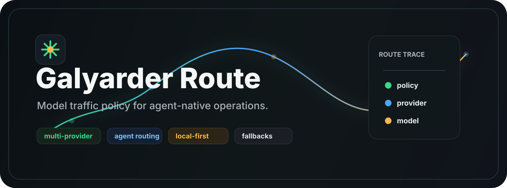

<p align="center">
  
</p>

<h1 align="center">Galyarder Route</h1>

<p align="center">Routing infrastructure for AI-native operations, agent fleets, and model traffic policy.</p>

<p align="center">
  <a href="LICENSE"></a>
  <a href="https://github.com/galyarderlabs/galyarder-route/stargazers"></a>
  <a href="https://github.com/galyarderlabs/galyarder-framework"></a>
  <a href="https://galyarderlabs.github.io/galyarder-route/"></a>
</p>

<p align="center">
  Open source · Self-hosted · Local-first
</p>

<p align="center">
  <a href="https://galyarderlabs.github.io/galyarder-route/">Documentation</a> ·
  <a href="docs/SETUP_GUIDE.md">Setup</a> ·
  <a href="docs/API_REFERENCE.md">API Reference</a> ·
  <a href="docs/CLI-TOOLS.md">CLI Tools</a>
</p>

---

The next generation of agent work will not be one model, one API key, or one browser session. It will be a stack of tools that need stable routing, budget control, fallback, and policy without every agent memorizing provider details.

Galyarder Route is the infrastructure for that. A self-hosted routing layer where Claude Code, Codex, Gemini CLI, OpenCode, Hermes, G-Agent, MCP clients, browser automation, and OpenAI-compatible workflows can share one governed model surface. Not a wrapper. Not a demo proxy. A local-first route layer for real agent operations.

The shift is already happening. The question is whether your agents route through policy, or whether every tool keeps improvising alone.

---

## The idea

Galyarder Route is a self-hosted model and agent traffic layer. It sits between your tools and upstream providers, then exposes a consistent API surface for daily agent work.

It supports:

- OpenAI-compatible chat, completions, embeddings, images, audio, video, rerank, batch, and moderation endpoints.
- Anthropic Messages compatibility for Claude-style clients.
- Gemini and OpenAI Responses protocol translation.
- Multi-provider routing with aliases, account pools, fallbacks, quotas, and health-aware retry.
- Dashboard configuration for providers, models, combos, routing, logs, spend, compression, and CLI setup.
- MCP and A2A surfaces for agent-to-agent and tool-driven operation.
- Local-first deployment for workstation and server setups.

## How it works

Modern agent work is not one model and one API key. A real operating stack may need:

- premium models for planning and code review;
- cheaper models for bulk generation;
- Gemini or Claude routes for tool-specific behavior;
- Codex, Claude Code, OpenCode, Hermes, and G-Agent using the same policy;
- model aliases that stay stable even when provider names change;
- fallback when quota, region, auth, or upstream latency breaks;
- cache protection for long sessions and expensive context.

Galyarder Route is the policy layer for that stack.

## What you get

### Unified API Surface

Use one local endpoint for multiple model protocols:

- `/v1/chat/completions`
- `/v1/responses`
- `/v1/messages`
- `/v1/models`
- `/v1/images/generations`
- `/v1/audio/speech`
- `/v1/audio/transcriptions`
- `/v1/embeddings`
- `/v1/rerank`
- `/v1/batches`

Clients can speak OpenAI-compatible, Anthropic-compatible, Gemini-compatible, or internal agent protocols while the route layer normalizes the upstream behavior.

### Routing Strategies

Combos can route traffic through different strategies:

- priority routing for premium-first work;
- weighted routing for controlled distribution;
- round-robin and strict random routing for spread;
- fill-first routing for quota use;
- least-used and power-of-two-choices balancing;
- cost-optimized routing;
- last-known-good routing for stable sessions;
- context-optimized routing for long prompts;
- context relay for multi-provider handoff.

### Model Alias Policy

Short aliases are first-class. Galyarder Route keeps operational aliases stable, including `gpt-*`, `o*`, `claude-*`, `gemini-*`, and project-specific routes.

That means an agent can request the model family it needs while the router maps it to the correct provider backend.

### Agent Tooling

The dashboard includes guided setup and runtime detection for common agent tools:

- Claude Code
- Codex
- Gemini CLI
- OpenCode
- Hermes
- G-Agent
- Qwen Code
- Cline and compatible clients
- MCP clients

G-Agent and Hermes configuration are built into the application source. They do not depend on post-install patch scripts.

### Reliability And Safety

Galyarder Route includes:

- provider health checks;
- cooldown-aware retry;
- quota and spend tracking;
- request logging with artifact capture;
- outbound SSRF protection for provider URLs;
- API key masking and scoped authentication;
- cache-control policy handling;
- protected cache behavior for agent tools;
- local data paths suitable for workstation use.

### Compression And Context Control

For long-running work, Galyarder Route includes compression and context tooling:

- semantic cache;
- reasoning cache cleanup;
- RTK compression;
- Caveman compression;
- compression combos;
- prompt and payload rules;
- context relay support.

### Dashboard

The web dashboard is the operations console for the routing layer:

- provider setup;
- model catalog and aliases;
- combo builder;
- request logs;
- usage analytics;
- quota health;
- CLI tools setup;
- MCP and A2A configuration;
- resilience settings;
- release notes and system status.

## Supported clients

Galyarder Route is not meant to replace every tool in an AI stack. It gives those tools one governed model route, then lets each client keep the job it is best at.

- Coding agents use one endpoint for model access, fallback, aliases, and quota policy.
- CLI tools can share the same provider setup without duplicating API keys and routing rules.
- Automation and QA systems can run isolated sessions while still using the same model policy.
- Product services can call stable aliases instead of hardcoding upstream provider names.
- Operators can inspect logs, spend, health, and routing behavior from the dashboard.

The rule is routing by use case: clients handle their workflow, Galyarder Route handles model traffic.

## Quickstart

```bash
git clone https://github.com/galyarderlabs/galyarder-route.git
cd galyarder-route
npm install
npm run dev
```

Open:

```text
http://localhost:20128
```

Node.js support:

```text
>=20.20.2 <21
>=22.22.2 <23
>=24.0.0 <27
```

## Basic API Use

```bash
curl http://localhost:20128/v1/chat/completions \
  -H "Authorization: Bearer $GALYARDER_ROUTE_API_KEY" \
  -H "Content-Type: application/json" \
  -d '{
    "model": "gpt-5.5",
    "messages": [
      { "role": "user", "content": "Route this through the best available model." }
    ]
  }'
```

## Development

```bash
npm run dev                 # Start the local dashboard and API
npm run build               # Build the app
npm run typecheck:core      # Type-check core code
npm run test:unit           # Run unit tests
npm run test:e2e            # Run Playwright tests
```

Useful checks:

```bash
npm run check:node-runtime
npm run check:pack-artifact
npm run check
```

## Repository Shape

```text
src/                 Application, dashboard, API routes, shared logic
open-sse/            Streaming sidecar and protocol translation
bin/                 CLI entrypoints
scripts/             Build, validation, release, and runtime helpers
docs/                Product, deployment, API, and operations docs
tests/               Unit, integration, e2e, and security tests
electron/            Desktop shell
```

## Deployment

Galyarder Route can run locally on a workstation, inside Docker, or on a VPS. The default local port is `20128`.

Common deployment docs live under `docs/`:

- `docs/SETUP_GUIDE.md`
- `docs/DOCKER_GUIDE.md`
- `docs/VM_DEPLOYMENT_GUIDE.md`
- `docs/API_REFERENCE.md`
- `docs/CLI-TOOLS.md`
- `docs/MCP-SERVER.md`

## License

MIT License. Copyright 2026 Galyarder Labs.
